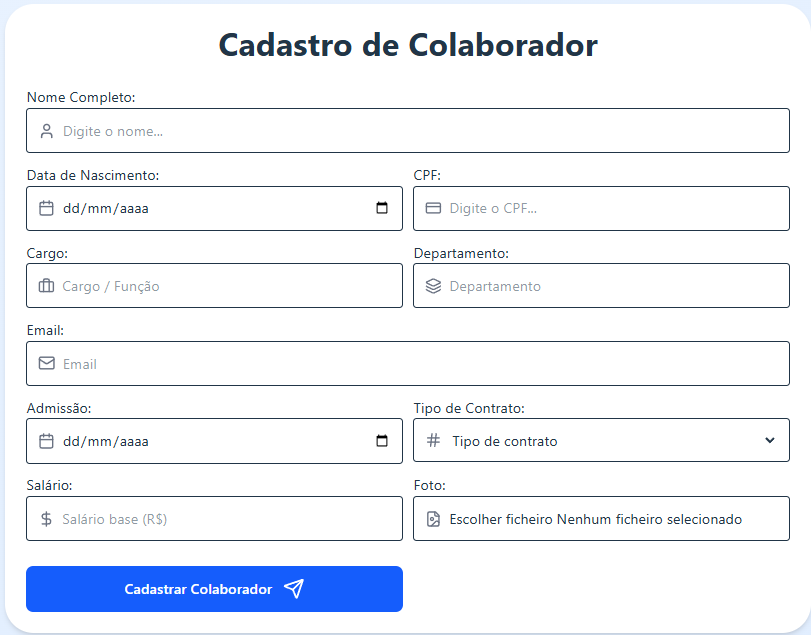
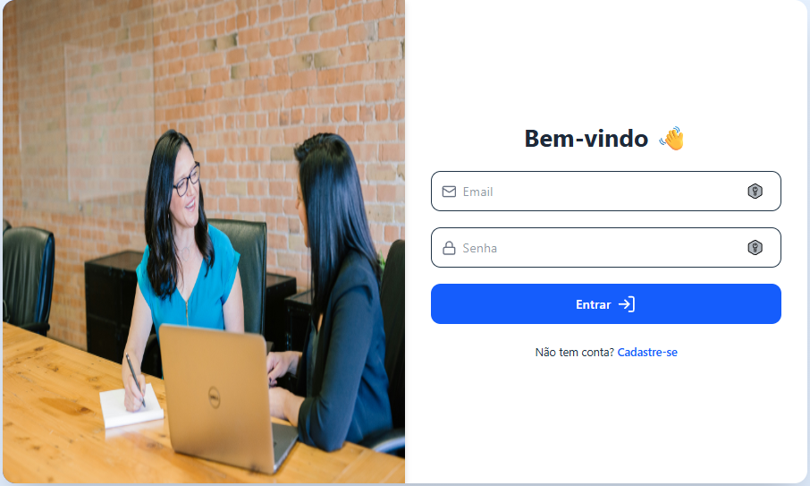
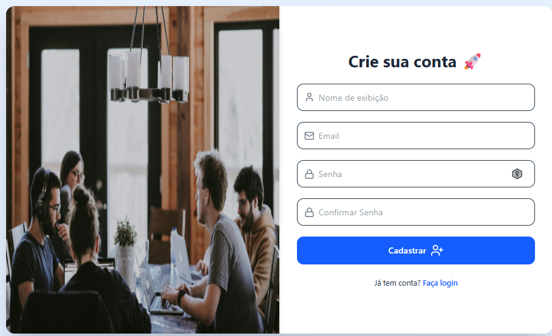

# DevUser 🧑‍💻  

  
  
  

---

## 🧑‍💻 Sobre o DevUser  

O **DevRH** é uma aplicação web desenvolvida para **cadastro, login e gerenciamento de usuários**, com foco em **experiência simples, moderna e segura**.  

Esse projeto foi criado para demonstrar habilidades práticas em **frontend, backend e automação**, simulando um sistema real de autenticação, CRUD e integração de dados.  

---

## ⚙️ Funcionalidades  

- ✅ Cadastro e login de usuários via **Supabase** (autenticação segura)  
- ✅ Visualização e gerenciamento de usuários cadastrados  
- ✅ Edição e exclusão de informações de forma intuitiva  
- ✅ Formulário moderno em **React + Tailwind**  
- ✅ Integração com **n8n** para automação de processos  
- ✅ Envio de dados para o **Google Sheets** para análises e relatórios  
- ✅ Possibilidade de integração com **Power BI** para dashboards dinâmicos  

---

## 🚀 Tecnologias  

  
  
  
  
  

---

## 📌 Objetivo  

O **DevRH** foi desenvolvido com a missão de:  
- Praticar e aplicar conceitos de **aplicações web modernas**;  
- Explorar autenticação com **Supabase**;  
- Demonstrar integrações entre **frontend, automação (n8n) e banco de dados**;  
- Criar uma base escalável para projetos futuros, como **dashboards em Power BI**.  

---

## 📸 Imagens  

  
  
 

---

## 🤝 Agradecimentos e Contribuições  

Quero agradecer a uma das maiores escolas do Brasil para desenvolvedores(as), o **DevClub**, pelo aprendizado e apoio.  
